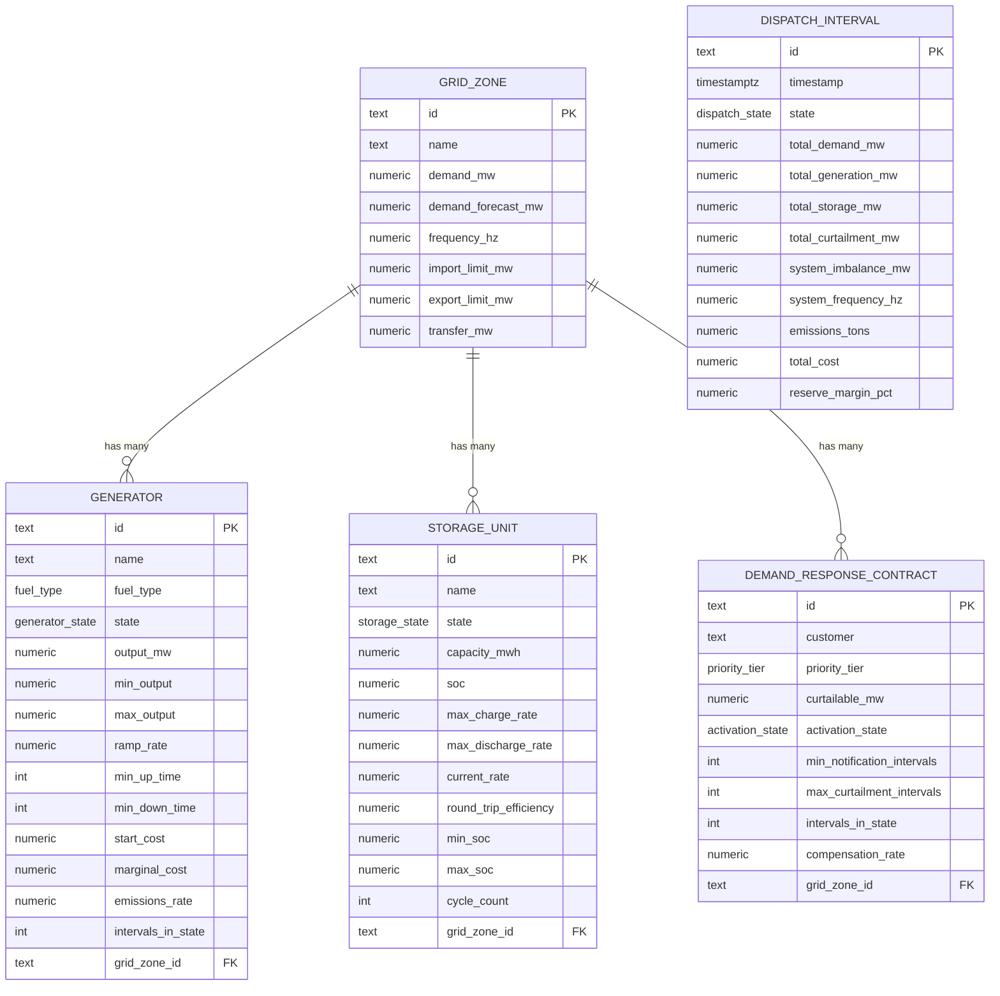
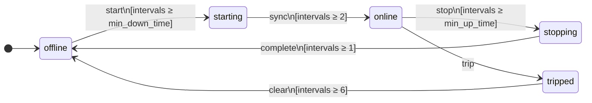
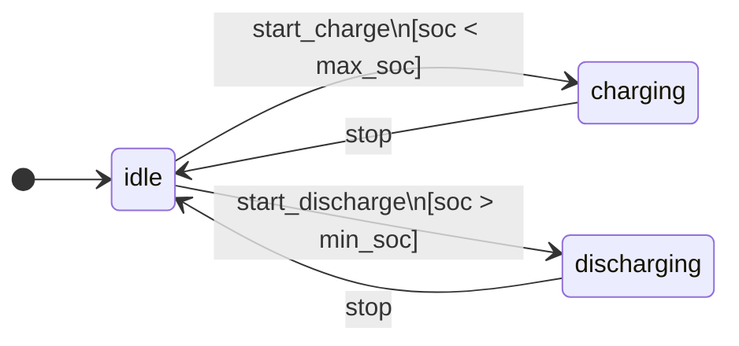
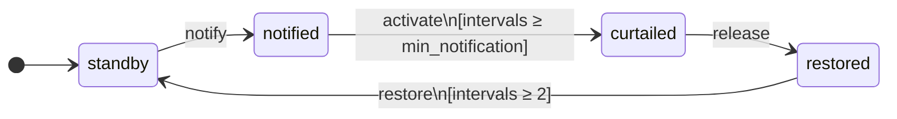
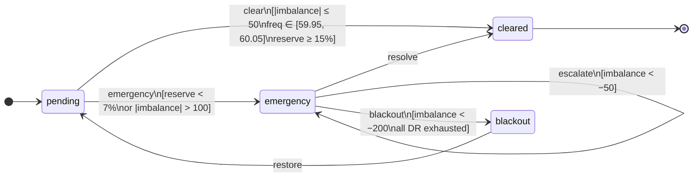

# Energy Grid — State Machines & ER Diagram

## Entity Relationships

```mermaid
erDiagram
    GRID_ZONE ||--o{ GENERATOR : "has many"
    GRID_ZONE ||--o{ STORAGE_UNIT : "has many"
    GRID_ZONE ||--o{ DEMAND_RESPONSE_CONTRACT : "has many"

    GRID_ZONE {
        text id PK
        text name
        numeric demand_mw
        numeric demand_forecast_mw
        numeric frequency_hz
        numeric import_limit_mw
        numeric export_limit_mw
        numeric transfer_mw
    }

    GENERATOR {
        text id PK
        text name
        fuel_type fuel_type
        generator_state state
        numeric output_mw
        numeric min_output
        numeric max_output
        numeric ramp_rate
        int min_up_time
        int min_down_time
        numeric start_cost
        numeric marginal_cost
        numeric emissions_rate
        int intervals_in_state
        text grid_zone_id FK
    }

    STORAGE_UNIT {
        text id PK
        text name
        storage_state state
        numeric capacity_mwh
        numeric soc
        numeric max_charge_rate
        numeric max_discharge_rate
        numeric current_rate
        numeric round_trip_efficiency
        numeric min_soc
        numeric max_soc
        int cycle_count
        text grid_zone_id FK
    }

    DEMAND_RESPONSE_CONTRACT {
        text id PK
        text customer
        priority_tier priority_tier
        numeric curtailable_mw
        activation_state activation_state
        int min_notification_intervals
        int max_curtailment_intervals
        int intervals_in_state
        numeric compensation_rate
        text grid_zone_id FK
    }

    DISPATCH_INTERVAL {
        text id PK
        timestamptz timestamp
        dispatch_state state
        numeric total_demand_mw
        numeric total_generation_mw
        numeric total_storage_mw
        numeric total_curtailment_mw
        numeric system_imbalance_mw
        numeric system_frequency_hz
        numeric emissions_tons
        numeric total_cost
        numeric reserve_margin_pct
    }
```

## Generator Lifecycle

```mermaid
stateDiagram-v2
    direction LR
    [*] --> offline
    offline --> starting : start\n[intervals ≥ min_down_time]
    starting --> online : sync\n[intervals ≥ 2]
    online --> stopping : stop\n[intervals ≥ min_up_time]
    stopping --> offline : complete\n[intervals ≥ 1]
    online --> tripped : trip
    tripped --> offline : clear\n[intervals ≥ 6]
```

## Storage Unit

```mermaid
stateDiagram-v2
    direction LR
    [*] --> idle
    idle --> charging : start_charge\n[soc < max_soc]
    idle --> discharging : start_discharge\n[soc > min_soc]
    charging --> idle : stop
    discharging --> idle : stop
```

## Demand Response Contract

```mermaid
stateDiagram-v2
    direction LR
    [*] --> standby
    standby --> notified : notify
    notified --> curtailed : activate\n[intervals ≥ min_notification]
    curtailed --> restored : release
    restored --> standby : restore\n[intervals ≥ 2]
```

## Dispatch Interval

```mermaid
stateDiagram-v2
    direction LR
    [*] --> pending
    pending --> cleared : clear\n[|imbalance| ≤ 50\nfreq ∈ [59.95, 60.05]\nreserve ≥ 15%]
    pending --> emergency : emergency\n[reserve < 7%\nor |imbalance| > 100]
    emergency --> cleared : resolve
    emergency --> emergency : escalate\n[imbalance < −50]
    emergency --> blackout : blackout\n[imbalance < −200\nall DR exhausted]
    blackout --> pending : restore
    cleared --> [*]
```
